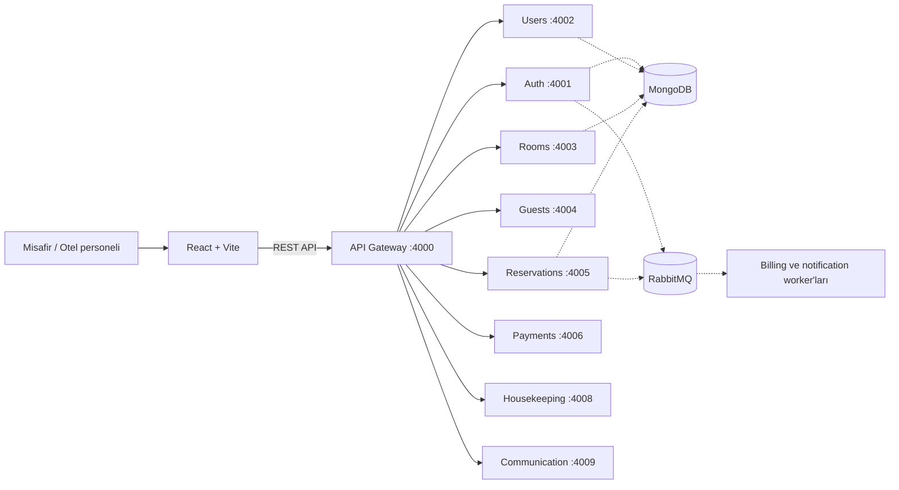

# Elite Hotel

Modern bir otel yönetim platformu. Misafirlerin oda keşfetme ve rezervasyon yapma deneyimini; otel ekibinin operasyon, ödeme ve misafir yönetimi araçlarıyla bir araya getirir.

Frontend, **React + TypeScript + Vite**; backend ise **Node.js + Express + TypeScript** ile geliştirilmiştir. Backend, bağımsız servislerden oluşur; servisler arası mesajlaşmada **RabbitMQ**, kalıcı veride **MongoDB** kullanılır.

## İçindekiler

- [Öne çıkan özellikler](#öne-çıkan-özellikler)
- [Teknolojiler](#teknolojiler)
- [Mimari ve servisler](#mimari-ve-servisler)
- [Gereksinimler](#gereksinimler)
- [Yerel kurulum](#yerel-kurulum)
- [Ortam değişkenleri](#ortam-değişkenleri)
- [Uygulamayı çalıştırma](#uygulamayı-çalıştırma)
- [Docker Compose](#docker-compose)
- [API ve sağlık kontrolü](#api-ve-sağlık-kontrolü)
- [Komutlar](#komutlar)
- [Sorun giderme](#sorun-giderme)
- [Katkıda bulunma](#katkıda-bulunma)

## Öne çıkan özellikler

### Misafir deneyimi

- Oda listeleme, arama ve filtreleme
- Tarih ve kişi sayısına göre müsait oda arama
- Rezervasyon fiyat teklifi ve çevrimiçi rezervasyon
- Stripe veya Razorpay ile ödeme entegrasyonu
- Rezervasyon koduyla rezervasyon görüntüleme
- Misafir hesabı, profil ve kimlik doğrulama akışları

### Otel operasyonları

- Yönetici ve resepsiyonist panelleri
- Oda, rezervasyon, kullanıcı ve misafir yönetimi
- Faturalama ve ödeme ekranları
- Kat hizmetleri görev takibi
- Bildirimler ve gerçek zamanlı iletişim özellikleri
- Chatbot ve sesli asistan arayüzleri
- İngilizce, İspanyolca ve Fransızca dil dosyaları

> Entegrasyonların kullanılabilirliği, ilgili servislerin çalışır durumda olmasına ve gerekli sağlayıcı anahtarlarının yapılandırılmasına bağlıdır.

## Teknolojiler

| Alan | Teknolojiler |
| --- | --- |
| Frontend | React 19, TypeScript, Vite, Tailwind CSS |
| İstemci durumu ve veri | Redux Toolkit, TanStack Query, Axios |
| Backend | Node.js, Express, TypeScript |
| Veritabanı | MongoDB, Mongoose |
| Mesajlaşma | RabbitMQ, amqplib |
| Gerçek zamanlı iletişim | Socket.IO |
| Medya | AWS S3 ve Cloudinary entegrasyonları |
| Ödemeler | Stripe ve Razorpay entegrasyonları |
| CI/CD | GitHub Actions, Docker |

## Mimari ve servisler



| Servis | Dizin | Port | Görev |
| --- | --- | ---: | --- |
| API Gateway | `backend/api-gateway` | 4000 | Frontend isteklerini backend servislerine yönlendirir |
| Auth | `backend/services/authService` | 4001 | Kimlik doğrulama |
| User | `backend/services/userService` | 4002 | Kullanıcı yönetimi |
| Room | `backend/services/roomService` | 4003 | Oda ve görsel yönetimi |
| Guest | `backend/services/guestService` | 4004 | Misafir yönetimi |
| Reservation | `backend/services/reservationService` | 4005 | Müsaitlik ve rezervasyon işlemleri |
| Payment | `backend/services/paymentService` | 4006 | Ödeme sağlayıcıları |
| Billing | `backend/services/billingService` | — | Arka plan faturalama tüketicisi |
| Notification | `backend/services/notificationService` | — | RabbitMQ üzerinden arka plan bildirimleri |
| Housekeeping | `backend/services/houseKeepingService` | 4008 | Kat hizmetleri görevleri |
| Communication | `backend/services/communicationService` | 4009 | İletişim ve gerçek zamanlı özellikler |

`—` işaretli servisler Docker Compose yapılandırmasında host portuna açılmaz.

### Proje yapısı

```text
.
├── backend/
│   ├── api-gateway/
│   └── services/
│       ├── authService/
│       ├── billingService/
│       ├── communicationService/
│       ├── guestService/
│       ├── houseKeepingService/
│       ├── notificationService/
│       ├── paymentService/
│       ├── reservationService/
│       ├── roomService/
│       └── userService/
├── demo-data/
├── frontend/
├── docker-compose.yml
└── README.md
```

## Gereksinimler

- Node.js **20.19+** veya **22.12+** ve npm (Vite 7 gereksinimi)
- MongoDB (yerel kurulum veya erişilebilir bir MongoDB URI)
- RabbitMQ (yerel kurulum ya da Docker)
- Git
- İsteğe bağlı: Docker ve Docker Compose
- İsteğe bağlı: Stripe, Razorpay, AWS S3, Cloudinary veya Gemini hesabı (kullanılan özelliğe göre)

## Yerel kurulum

### 1. Depoyu klonlayın

```bash
git clone <REPOSITORY_URL>
```

`<REPOSITORY_URL>` yerine GitHub deposunun HTTPS veya SSH adresini yazın. Klonlama tamamlandıktan sonra indirilen depo klasörüne geçin; aşağıdaki komutları depo kök dizininde çalıştırın.

### 2. Bağımlılıkları yükleyin

Proje kök dizininde:

```bash
for dir in backend/api-gateway backend/services/* frontend; do
  (cd "$dir" && npm ci) || exit 1
done
```

Her servis bağımsız bir `package.json` ve lock dosyası kullanır.

### 3. Altyapı servislerini hazırlayın

Backend servislerini başlatmadan önce MongoDB ve RabbitMQ erişilebilir olmalıdır.

- MongoDB URI'larını ilgili servislerin `.env` dosyalarına yazın.
- RabbitMQ yerel makinede çalışıyorsa URI genellikle `amqp://localhost:5672` olur.
- Docker Compose kullanıyorsanız konteyner içindeki servislerin `localhost` adresinin ana makineyi değil, kendi konteynerini gösterdiğini unutmayın. Docker bölümündeki ağ ayarlarına bakın.

### 4. Ortam dosyalarını oluşturun

`.env` dosyaları Git tarafından yok sayılır; gerçek anahtarları depoya eklemeyin. Her backend servisi kendi dizinindeki `.env` dosyasını okur. Var olan şablonlar:

- `backend/api-gateway/.env.example`
- `backend/services/userService/.env.example`
- `backend/services/communicationService/.env.example`

Diğer servislerde gereken ayarları ilgili servis koduna ve entegrasyon bölümüne göre belirleyip servis dizinine `.env` dosyası oluşturun. `.s3template` dosyaları alternatif S3 yapılandırma örnekleridir; bunları doğrudan eksiksiz varsayılan yapılandırma olarak kullanmayın.

### 5. Frontend ortam dosyasını ekleyin

`frontend/.env.local` dosyasını oluşturun:

```env
VITE_API_BASE_URL=http://localhost:4000/api
VITE_AUTH_API_BASE_URL=http://localhost:4001
VITE_COMMUNICATION_SERVICE_URL=http://localhost:4009

# İsteğe bağlı: çevrimiçi ödeme
VITE_STRIPE_PUBLISHABLE_KEY=
VITE_RAZORPAY_KEY_ID=
```

`VITE_` ile başlayan değerler frontend derlemesine dahil edilir. Bu nedenle bu dosyaya **gizli anahtar veya sunucu tarafı secret'ı koymayın**. Stripe/Razorpay secret anahtarları yalnızca ilgili backend servislerinde tanımlanmalıdır.

### 6. Servisleri başlatın

Her komutu ayrı bir terminal penceresinde, depo kök dizininden çalıştırın:

```bash
cd backend/api-gateway && npm run dev
```

```bash
cd backend/services/authService && npm run dev
```

```bash
cd backend/services/userService && npm run dev
```

```bash
cd backend/services/roomService && npm run dev
```

```bash
cd backend/services/guestService && npm run dev
```

```bash
cd backend/services/reservationService && npm run dev
```

```bash
cd backend/services/paymentService && npm run dev
```

```bash
cd backend/services/houseKeepingService && npm run dev
```

```bash
cd backend/services/communicationService && npm run dev
```

İhtiyaç duyulan arka plan tüketicilerini de başlatın:

```bash
cd backend/services/billingService && npm run dev
```

```bash
cd backend/services/notificationService && npm run dev
```

Frontend'i ayrı bir terminalde başlatın:

```bash
cd frontend
npm run dev
```

Vite genellikle `http://localhost:5173` adresinde açılır. Terminalde gösterilen adresi kullanın.

## Ortam değişkenleri

Değişken adları servise göre farklılık gösterebilir. Aşağıdaki liste, yapılandırılması beklenen başlıca ayarları özetler; her servis için yalnızca o servisin kullandığı değişkenleri ekleyin.

| Ayar | Kullanıldığı yer | Açıklama |
| --- | --- | --- |
| `GATEWAY_PORT` | API Gateway | Gateway portu; yerel varsayılan `4000` |
| `CORS_ORIGINS` | API Gateway ve servisler | İzin verilecek frontend origin'leri; virgülle ayrılmış URL listesi |
| `*_API_BASE_URL` | API Gateway | Gateway'in yönlendirdiği backend servis adresleri |
| `MONGODB_URI` | Veritabanı kullanan servisler | MongoDB bağlantı URI'sı |
| `RABBITMQ_URL` | Mesajlaşma kullanan servisler | RabbitMQ bağlantı URI'sı |
| `ACCESS_TOKEN_SECRET`, `REFRESH_TOKEN_SECRET`, `JWT_SECRET` | Kimlik doğrulama kullanan servisler | Güçlü, benzersiz token imzalama secret'ları |
| `STRIPE_SECRET_KEY`, `STRIPE_WEBHOOK_SECRET` | Payment Service | Stripe sunucu tarafı anahtarları |
| `RAZORPAY_KEY_ID`, `RAZORPAY_SECRET`, `RAZORPAY_WEBHOOK_SECRET` | Payment Service | Razorpay sunucu tarafı anahtarları |
| `AWS_S3_*`, `AWS_REGION` | Medya kullanan servisler | S3 bucket ve erişim yapılandırması |
| `CLOUDINARY_*` | Medya kullanan servisler | Cloudinary hesabı ve API yapılandırması |
| `GEMINI_API_KEY`, `GEMINI_MODEL` | Communication Service | Chatbot sağlayıcısı ayarları |
| `VITE_API_BASE_URL` | Frontend | Gateway API kök adresi; ör. `http://localhost:4000/api` |
| `VITE_AUTH_API_BASE_URL` | Frontend | Auth Service adresi; ör. `http://localhost:4001` |
| `VITE_COMMUNICATION_SERVICE_URL` | Frontend | Communication Service adresi; ör. `http://localhost:4009` |
| `VITE_STRIPE_PUBLISHABLE_KEY`, `VITE_RAZORPAY_KEY_ID` | Frontend | İstemci tarafı ödeme sağlayıcısı anahtarları |

Geliştirme ortamında dahi örnek/fallback JWT secret'larını kullanmayın. Üretim ortamında secret'ları güvenli bir secret manager üzerinden sağlayın.

## Docker Compose

Kök dizindeki `docker-compose.yml`, backend servisleri için Docker Hub'da yayımlanmış imajları kullanır; frontend'i **başlatmaz**. Compose RabbitMQ'yu başlatır, ancak MongoDB servisi Compose dosyasında tanımlı değildir. Başlatmadan önce:

1. Docker Desktop veya Docker Engine'i çalıştırın.
2. Compose dosyasının `env_file` ile beklediği her servis için ilgili `.env` dosyasını oluşturun.
3. MongoDB'yi ayrıca çalıştırın veya erişilebilir bir bulut MongoDB URI'sı ayarlayın.
4. Konteyner içi bağlantıları yapılandırın:
   - RabbitMQ adresi: `amqp://rabbitmq:5672`
   - macOS/Windows ana makinesindeki MongoDB'ye erişim için URI host'u: `host.docker.internal`
   - Gateway servis hedefleri: `http://auth-service:4001`, `http://user-service:4002`, `http://room-service:4003` gibi Compose servis adları. Konteyner içinden `localhost` kullanmayın.
5. Gateway portunu `4000` ve frontend için CORS origin'ini Vite adresiyle eşleştirin.

Sonra:

```bash
docker compose up -d
docker compose ps
docker compose logs -f
```

Servisleri durdurmak için:

```bash
docker compose down
```

Compose dosyası `latest` etiketli yayımlanmış backend imajlarını çeker. Kaynak koddan imaj oluşturmak istiyorsanız her servis için kendi `Dockerfile`'ını kullanarak ayrı bir build yapılandırması hazırlayın; mevcut Compose dosyasının imajları otomatik olarak kaynak koddan derlediğini varsaymayın.

## API ve sağlık kontrolü

API Gateway'in sağlık kontrolü:

```bash
curl http://localhost:4000/health
```

Gateway'in kök uç noktası servis yollarını döndürür:

```bash
curl http://localhost:4000/
```

Gateway üzerinden kullanılan başlıca yol önekleri:

| Yol | Hedef |
| --- | --- |
| `/api/auth` | Auth Service |
| `/api/users` | User Service |
| `/api/rooms` | Room Service |
| `/api/guests` | Guest Service |
| `/api/reservations` | Reservation Service |
| `/api/payments` | Payment Service |
| `/api/billing` | Billing Service |
| `/api/housekeeping` | Housekeeping Service |
| `/api/communication` | Communication Service |
| `/api/notifications` | Notification Service |

Oda listeleme gibi bir istek, frontend yapılandırmasına göre `http://localhost:4000/api/rooms` üzerinden gönderilir. Servis uç noktaları ve istek şemaları ilgili servislerin `routes` ve `controllers` dizinlerinde tanımlıdır.

## Komutlar

### Frontend

```bash
cd frontend
npm run dev       # Vite geliştirme sunucusu
npm run build     # TypeScript kontrolü ve production derlemesi
npm run lint      # ESLint
npm run preview   # Production derlemesini yerelde önizle
```

### Backend servisleri

Komutları ilgili servis dizininde çalıştırın:

```bash
npm run dev       # Geliştirme sunucusu
npm run build     # TypeScript derlemesi
npm start         # Derlenmiş uygulamayı çalıştır
```

Oda örnek verilerini eklemek için (veritabanı yapılandırması yapıldıktan sonra):

```bash
cd backend/services/roomService
npm run seed
```

## Sorun giderme

### Gateway çalışıyor ama API istekleri başarısız

- İlgili backend servisinin ayrıca başlatıldığını doğrulayın.
- Frontend'deki `VITE_API_BASE_URL` değerinin `/api` ile bittiğini kontrol edin.
- Gateway servis hedeflerinin doğru host ve portları gösterdiğini kontrol edin.
- Gateway günlüklerinde proxy hatalarını inceleyin.

### MongoDB bağlantısı kurulamıyor

- MongoDB'nin çalıştığını ve URI'nin doğru olduğunu doğrulayın.
- Docker içindeki servislerde `localhost` kullanmayın; uygun ana makine adresini ya da bulut URI'sını kullanın.
- Veritabanı erişim izni ve ağ kısıtlamalarını kontrol edin.

### RabbitMQ bağlantısı kurulamıyor

- RabbitMQ'nun çalıştığını doğrulayın.
- Yerel süreçten bağlanıyorsanız `localhost:5672`; Compose ağı içinden bağlanıyorsanız `rabbitmq:5672` kullanın.
- Yönetim paneli açıksa `http://localhost:15672` adresinden kontrol edebilirsiniz.

### CORS hatası

- Gateway `CORS_ORIGINS` ayarına tarayıcıdaki frontend origin'ini ekleyin (varsayılan Vite adresi `http://localhost:5173`).
- Frontend portu değiştiyse origin değerini de güncelleyin.

### Port kullanımda

İlgili portu kullanan süreci bulun; rastgele süreç sonlandırmak yerine servisi güvenli biçimde durdurun veya uygulamanın port yapılandırmasını değiştirin.

### Ödeme, medya veya chatbot özelliği çalışmıyor

İlgili sağlayıcının backend secret'larının doğru servisin `.env` dosyasında, public istemci anahtarlarının ise yalnızca gerekiyorsa `frontend/.env.local` içinde tanımlı olduğunu kontrol edin.

## Katkıda bulunma

1. Depoyu fork'layın.
2. Açıklayıcı bir branch oluşturun: `git checkout -b feature/ozellik-adi`
3. Değişikliklerinizi yapın ve frontend için `npm run lint` ile `npm run build` komutlarını çalıştırın.
4. Commit oluşturun: `git commit -m "feat: ozellik aciklamasi"`
5. Branch'inizi gönderin ve Pull Request açın.

## Güvenlik

- Gerçek `.env` dosyalarını, API anahtarlarını, token'ları veya veritabanı kimlik bilgilerini commit etmeyin.
- Bir secret yanlışlıkla Git'e eklendiyse yalnızca dosyayı silmek yeterli değildir; ilgili anahtarı sağlayıcı panelinden iptal edip yenileyin.
- Güvenlik açığı bildirimlerinde hassas ayrıntıları herkese açık issue yerine depo sahibine özel olarak iletin.
